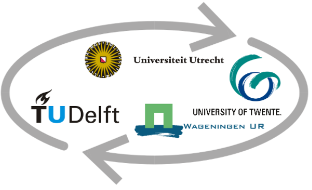

```{r}
#| include: false

lapply(c("knitr","dplyr","ggplot2"), require, character.only=TRUE)
```

# Introduction

```{r}
#| fig.align: left
#| column: margin
#| echo: false
#| layout-valigh: left

```


I am excited about the opportunity to intern in a Geo-Information workplace to apply my practical and theoretical skills from the master GIMA, Geographical Information Management and Applications. Coming from a background as a laboratory technician, I have always been familiar with measurements and data. This emphasis on data proved to be valuable during my internship in Air Europa, ensuring ISO 14001 and 9001 compliance in the Information Management System department based on evidence. GIMA studies deepened my interest in resolving challenges through spatial analysis, specially those related to climate change, given my environment sciences background. Please do get in touch if you are interested in discussing potential internships opportunities.