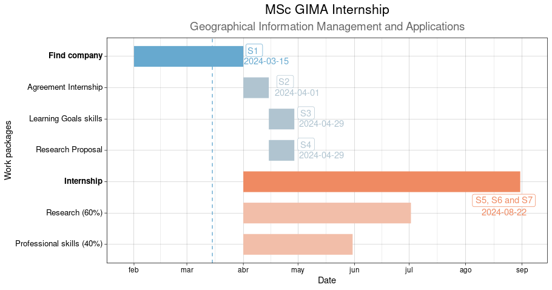

```{r}
#| include: false
#| fig.align: left
loadNamespace("lazyeval")
library("R.utils")
library("lazyeval")
lapply(c("knitr","dplyr","rjson","reactable","kableExtra","forcats","ggplot2","tidyverse","gt","lubridate","readODS","plotly"), require, character.only=TRUE)
```

# Introduction

I am excited about the opportunity to intern in a Geo-Information workplace to apply my practical and theoretical skills from the master GIMA, Geographical Information Management and Applications[^1].This internship is also an opportunity for the organizations interested. The four different universities that co-operates in this GIMA master offer a diversity in fields and their own traditions, so you can choose which one better suit your needs to carry out a research during the internship.

[^1]: <https://www.uu.nl/en/masters/geographical-information-management-and-applications-gima>

{width="50%" fig-align="center"}

Your organization can incorporate a research component from geo-information experts of these universities. Additionally, the internship also allocates time for the intern to gain professional skills helping you with existing projects, working on programming skills or project management tasks.The These are the focus of the Universities in GIMA:

-   **Utrecht University**: Geography and planning.
-   **Delft University of Technology**: Legal, organisational and technical aspects of geo-information handling.
-   **Wageningen University**: Agricultural and rural applications.
-   **University of Twente**: Technical and application oriented courses for developing countries.

If you are interested, he next sections give more information about this internship to better understand the process.

To accommodate organizations and students needs, GIMA offers **three different options** to arrange an Internship. The option A is focused on one company, while option B lasts the half and includes two companies. Lastly, option C is an intermediate with 540 hours as internship and 280 h to do 10 ECTs in courses. In all cases, 60% of the duration is spent to research a topic and 40% to gain professional skills, for example helping with existing projects.

The table 1 summarize these options and Figure 1 illustrates them.

```{r,echo=FALSE}
tribble(~Option,~Organization,~Duration,~Hours,
        "A","1 organization", "5-6 months", "840 h",
        "B","2 organizations","2.5-3 months","420 h*2",
        "C","1 organization and courses","3months","560 h+280 h") |>
  kable(caption="Table 1: The duration and number of organizations varies between the different options of internship")
```

```{r, echo =FALSE}
x <- c(0.001, 0.001, 0.001,
          0.45, 0.45, 0.45, 0.45, 0.45,
          0.9, 0.9)
y <- c(0.2, 0.52, 0.85,
          0.2, 0.45, 0.6, 0.8, 0.95,
          0.65, 0.2)
fig <- plotly::plot_ly(
    type = "sankey",
    orientation = "h",
    node = list(
      label = c("Option A", "Option B", "Option C", "Internship 1/1", "Internship 1/2", "Internship 2/2","Internship 1/1","Course 10 ECTS","Research","Work"),
      color = c("#179498", "#80b1d3", "#ad7237", "#179498", "#80b1d3", "#80b1d3","#ad7237","#ad7237","#fb8072","#9ad236"),
      text="Figure 1: Alluvial diagram shows how the 820 hours from the internship is distribuited across the different options",
      pad = 15,
      thickness = 15,
      line = list(
        color = "black",
        width = 0.5
      ), x=x, y=y
    ),
  link = list(
    source = c(0,1,1,2,2,3,3,4,4,5,5,6,6,7),  # Sources for the flows
    target = c(3,4,5,6,7,8,9,8,9,8,9,8,9,8),  # Targets for the flows
    value = c(840,420, 420,560,280,504,336,252,168,252,168,336,184,280 ))
) |> plotly::layout(title=paste0("<br>","Figure 1: Three options to arrange a GIMA internship"))
fig
```

# Purpose & Objectives

The internship aims to:

> -   To apply your gained theoretical and practical skills in a GIS working environment
> -   Increase your technical skills, gain insight into business/research, grow in social and professional attitude

The general objective is:

> To become familiar with the professional Geo-Information working environment

The main **benefits** for the organization are new solutions for their clients needs through a research project and support for the current needs and problems. This GIMA internship is academic in terms of having a research component where results are created and reflected upon. That is why the supervisor in the company must have a MSc degree and GI experience. Apart from that, any geo-information public, private organization or research institute is eligible to take part.

This is the [official Internship Agreement](https://www.universiteitenvannederland.nl/files/publications/Stageovereenkomst_EN_def.pdf) and other documentation such as a explanatory note regarding the agreement can be [found](https://www.universiteitenvannederland.nl/onderwerpen/onderwijs/gemeenschappelijke-stageovereenkomst-universiteiten).

# Work Breakdown Structure & Time

The following Gantt chart and the table 2 explain in detail the 7 steps or work packages of an internship following the option A. The dates are flexible and this is just an example. The blue colour indicates a planning phase that consists on finding a company and define the research proposal and learning goals skills. The orange colour shows the implementation phase by carrying out the internship.

{fig-align="center"}

```{r, echo=FALSE}
tribble(~Step,~Deliverable,~Time,~Description,
        "1","Internship Identification Description","Before the internship","The student finds a company and send a research propososal to the Internship Coordinator. After this, the student finds a GIMA internship supervisors expert on its research topic from any of the four universities.",
        "2","Agreement Internship","week 0-2","Student fills the internship agreement and recopilates signatures.This step should be taken before the start of the internship, otherwise within two weeks after the start of the internship",
        "3","Personal Learning Goals Internship","week 3-4","Student writes his/her Personal Learning Goals and arrange a kick-off meeting",
        "4","Extended Internship Proposal","week 3-4","The student writes an extended internship proposal",
        "4","Internship progress","half-way","The student plans and schedule the internship progress meeting",
        "5","Internship Report or Article Internship","final weeks","The sudent send the Internship Report and arrange a final internship meeting",
        "6","Personal Reflection Report","final weeks","The student writes the Personal Reflection Report expressing its academic opinion of the experience",
        "7","Summary report, Poster, or PowerPoint","final weeks","the Student submits a summary report") |>
  kable(caption = "Table 2:  An example of time planning for a GIMA internship")
```

If you are interested to have a chat, feel free to reach out. It would be great to connect with you.

The following table contains some of the potential supervisors from the different universities that take part in GIMA.

```{r, echo = FALSE, eval= FALSE}
staff <- read.csv("gima_catalogue.csv")
staff |>
  select(c(1,2,3)) |> 
reactable(filterable = TRUE, minRows =  5)
```
